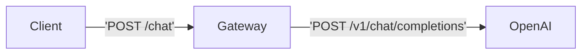
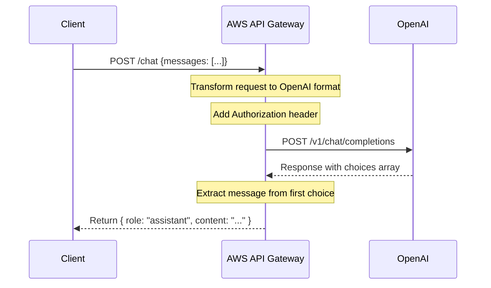

# FAAI - AI Chat Prototype

A quick way to prototype an AI chat interface using AWS API Gateway and
AlpineJS.

## Development

```bash
npm install  # install AWS cli and CDK and dev server
npm run dev  # start a local server pointing to index.html with hot reloading
```

## Infra

We use AWS API Gateway to create create a simpler chat interface with OpenAI
using VTL expressions to parse the request and response. We also store the
Authorization token in the API Gateway stage variables, making it hidden from
our client code.

### State diagram:



### Sequence diagram:



## Usage

### AWS API Gateway

The API Gateway is configured to use the `chat` route with a POST method.

```js
const response = await fetch("https://<MY_DOMAIN>/chat", {
  method: "POST",
  headers: { "Content-Type": "application/json" },
  body: JSON.stringify({ messages }),
});

const { message } = await response.json();
console.log(message);
// { role: "assistant", content: "Hello, how can I help you today?" }
```

### AlpineJS

We have implement a small `chat` component that can be used to display a chat
interface and that have some minor interactions:

- `clear` button to clear the chat history
- `remove` button to remove a message
- `send` button to send a message

The component is using AlpineJS to handle the state and the interactions.

```html
<div x-data="chat">
  <template x-for="(message, index) in messages" :key="index">
    <div x-text="message.content"></div>
  </template>
  <input
    type="text"
    x-model="input"
    @keyup.enter="send()"
    :disabled="status === 'loading'"
  />
  <button @click="send()" :disabled="input.trim() === ''">Send</button>
  <button @click="clear()" :disabled="messages.length === 0">Clear</button>
</div>
```
